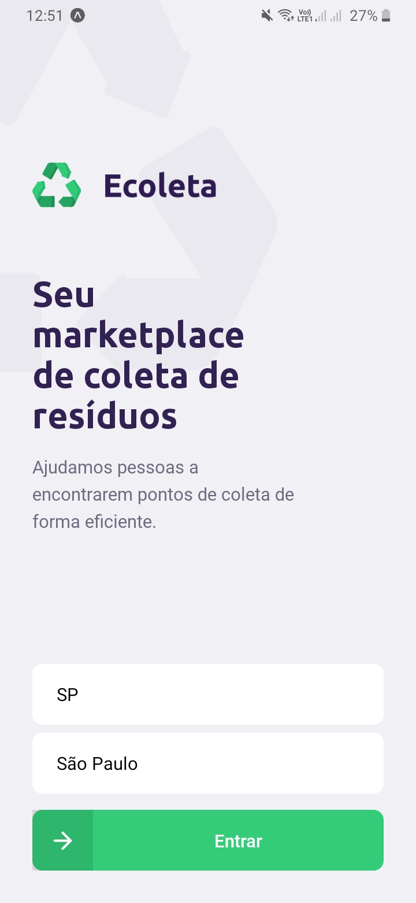
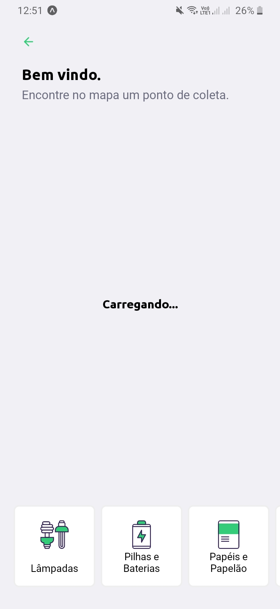
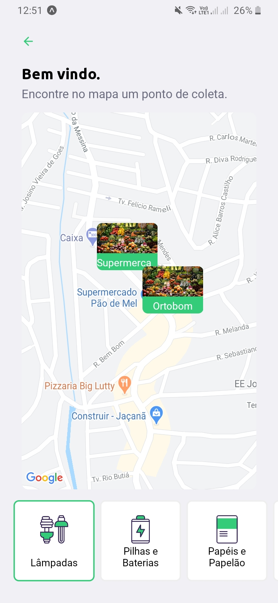
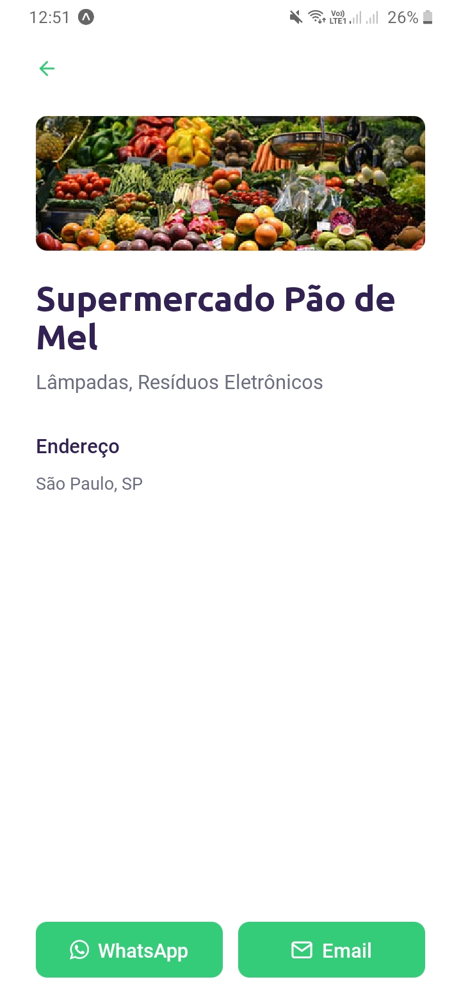

# NLW Ecoleta - Mobile

[](https://github.com/mikaelmessias/nlw-ecoleta-mobile/issues)
[](https://github.com/mikaelmessias/nlw-ecoleta-mobile/network)
[](https://github.com/mikaelmessias/nlw-ecoleta-mobile/stargazers)
[](https://github.com/mikaelmessias/nlw-ecoleta-mobile/blob/master/LICENSE)

O Ecoleta é um projeto desenvolvido durante a primeira edição da Next Level Week voltado para fins ecológicos, servindo como uma conexão entre empresas e entidades que coletam resíduos orgânicos ou inorgânicos às pessoas que precisam descartar esses resíduos. Pensando nisso, a aplicação mobile foi desenvolvida para exibir os pontos pontos de coletas próximos para as pessoas que tem interesse em descartar resíduos.

<p align="center">
  
  
  
  
<p>

## Começando

Escreva algumas instruções sobre como instalar e executar uma cópia do projeto na máquina local para propósitos de desenvolvimento e testes.

O mobile foi desenvolvido com o auxílio da ferramenta Expo, ["que permite o fácil acesso às API’s nativas do dispositivo sem precisar instalar qualquer dependência ou alterar código nativo"](https://blog.rocketseat.com.br/expo-react-native/), e da mesma forma que acontece com React e o CRA, o Expo permite iniciar um ambiente de desenvolvimento sem necessidade de instalar kits de desenvolvimentou ou ferramentas adicionais. As instruções para instalação e execução esão descritas a seguir.

### Pré-requisitos

Antes de executar a aplicação, é necessário instalar as dependências:

```bash
npm install
```

Também é necessária a instalação do Expo de forma global através do seguinte comando:

```bash
npm install -g expo-cli
```

### Execução

A execução do ambiente de desenvolvimento é iniciada a partir do expo-cli instalado anteriormente:

```bash
expo start
```

Se tudo ocorrer bem, o ```http://localhost:19002``` será aberto em uma aba do seu navegador. Para acessar pelo seu dispositivo móvel, basta scanear o QR Code pelo aplicativo Expo e aguardar alguns minutos até o bundle terminar de ser construído.

## Ferramentas

Ferramentas utilizadas para construção do sistema.

- [React](https://reactjs.org) - Biblioteca JavaScript para criar interfaces de usuário
- [React Native](https://reactnative.dev/) - Biblioteca Javascript para criação de aplicativos nativos para Android e iOS.
- [Typescript](https://www.typescriptlang.org/) - Superconjunto tipado do JavaScript.
- [Expo](https://expo.io/) - Ferramenta open-source para criação de aplicativos universais para Android, iOS e web com JavaScript e React.

## Autores

- **Mikael Messias** - _Desenvolvedor frontend_ - [Github](https://github.com/mikaelmessias)

## Licença

Esse projeto está licenciado sob a licença **GNU v3.0** - veja o arquivo LICENSE.md para mais detalhes.

## Agradecimentos

- [Billie Thompson](https://gist.github.com/PurpleBooth/109311bb0361f32d87a2)
- [Rocketseat](https://rocketseat.com.br)
